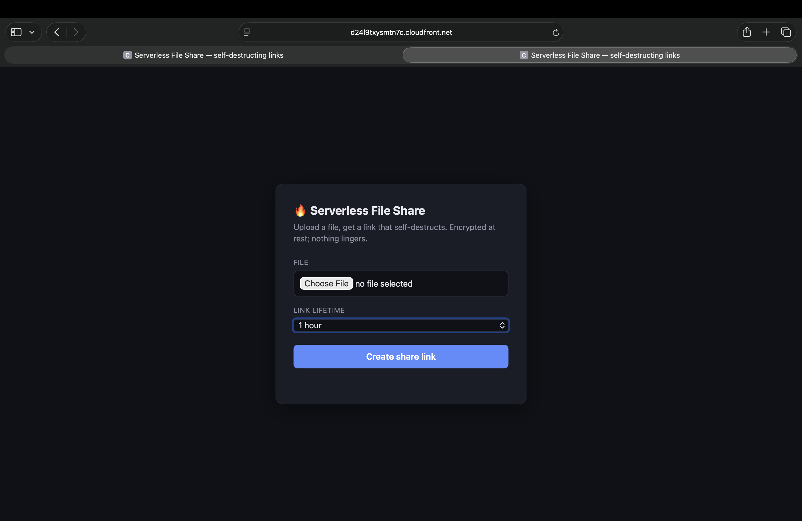
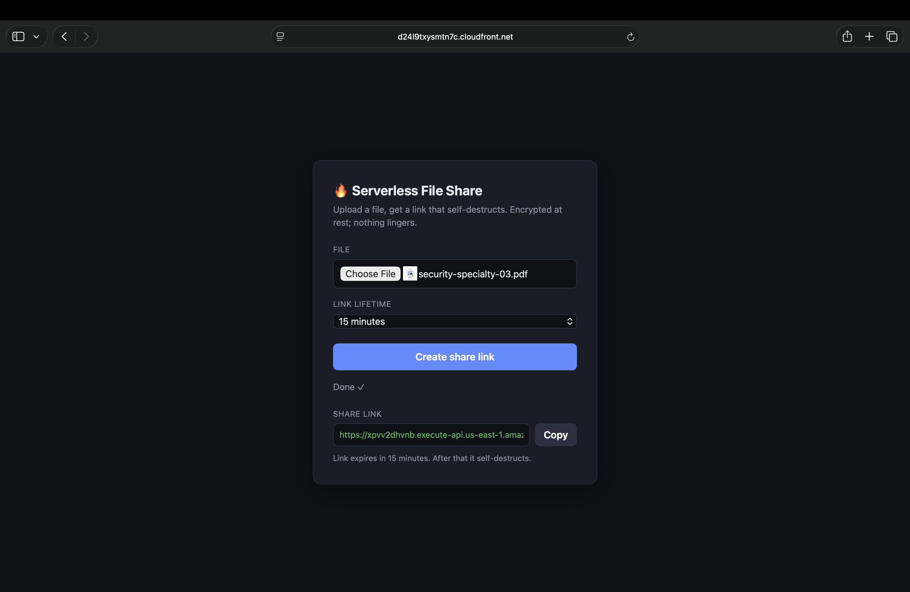
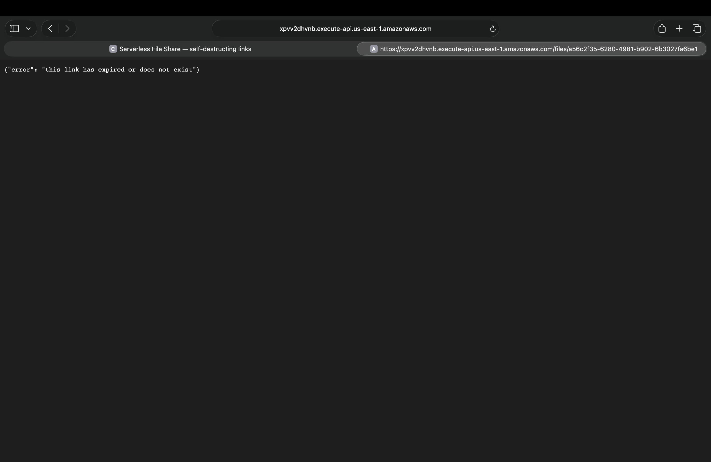

# Serverless File Share — self-destructing file sharing on AWS

Share a file through a link that expires. Files are encrypted at rest, links die on a timer, and the file itself is destroyed after expiry — nothing lingers.

**Status:** ✅ All stages complete — full IaC + CI/CD ([docs/stage5.md](docs/stage5.md)). See the [architecture diagram](docs/architecture.md). Built in public.

## Screenshots

| Upload | Share link | Expiry |
|---|---|---|
|  |  |  |

## Why this project

A small, real product that demonstrates security-first serverless architecture: least-privilege IAM, KMS encryption, short-lived access via presigned URLs, and a fully automated data lifecycle. No servers to patch, near-zero cost at rest.

## Target architecture

```
Sender/Recipient
      │
      ├──> CloudFront ──> S3 (static web UI)            [Stage 4]
      │
      └──> API Gateway ──> Lambda "issue-url"
                              │        │
                              │        └──> S3 files bucket (private, SSE-KMS)
                              │                      ▲ presigned PUT/GET
                              └──> DynamoDB (metadata, TTL)
                                       │  TTL expiry → DynamoDB Streams
                                       └──> Lambda "reaper" ──> deletes object + metadata
                                                                (S3 lifecycle rule as backstop)
```

## How it works (planned)

1. Sender asks the API for an upload link. Lambda returns a **presigned PUT URL** (short expiry) and writes a metadata item to DynamoDB with a **TTL** matching the file's lifetime.
2. The file lands in a **private, SSE-KMS-encrypted bucket**. Block Public Access is on account-wide; nothing is ever public.
3. The share link is a **presigned GET URL** whose expiry is chosen by the sender (15 minutes to 7 days).
4. When the TTL fires, DynamoDB Streams triggers the **reaper Lambda**, which deletes the S3 object and the metadata item. An S3 **lifecycle rule** acts as a backstop in case the reaper ever fails.

## Services and why

| Service | Role here |
|---|---|
| S3 | File storage; also hosts the static UI later |
| Lambda | issue-url (create presigned URLs + metadata) and reaper (delete on expiry) |
| API Gateway | HTTPS front door, throttling, later auth |
| DynamoDB | File metadata; TTL drives self-destruction; Streams triggers the reaper |
| KMS | Customer-managed key for SSE-KMS encryption at rest |
| IAM | One least-privilege role per Lambda |
| EventBridge | Alternative scheduler considered for expiry (documented trade-off) |
| CloudFront + Route 53 | UI delivery + custom domain (Stage 4) |
| Terraform + GitHub Actions | Infrastructure as code + CI/CD (Stage 5) |

## Security decisions

- **Block Public Access** everywhere; the only way to touch a file is a presigned URL.
- **SSE-KMS** with a customer-managed key; the key policy grants use only to the two Lambda roles.
- **Least privilege per function:** the issue-url role can `s3:PutObject`/`s3:GetObject` on the files prefix and `dynamodb:PutItem` on the table — a presigned URL can never grant more than its signer holds. The reaper role can only `s3:DeleteObject` and `dynamodb:DeleteItem`.
- **Short-lived everything:** upload URLs expire in minutes; download expiry is sender-chosen and capped.
- **No secrets in code**; CloudTrail on for a full audit trail.

## Roadmap

- [x] Stage 0 — Repo, account hygiene (IAM admin + MFA, $5 budget alarm), AWS CLI
- [x] Stage 1 — Manual MVP: private encrypted bucket, upload via CLI, presigned GET, verify expiry
- [x] Stage 2 — API: Lambda + API Gateway issue presigned URLs; DynamoDB metadata with TTL
- [x] Stage 3 — Self-destruct: TTL → Streams → reaper Lambda; lifecycle backstop; SSE-KMS + least-privilege IAM
- [x] Stage 4 — Minimal web UI on S3 + CloudFront (custom domain deferred — see docs/stage4.md)
- [x] Stage 5 — Terraform rebuild (`terraform/`, 38 resources), GitHub Actions CI/CD, [architecture diagram](docs/architecture.md)

## Cost

Designed to live in the free tier: S3 + Lambda + DynamoDB on-demand + API Gateway at hobby volume costs pennies. A $5 budget alarm guards the account.

---

Built by Rajolu Abheenash — [github.com/Abheenash](https://github.com/Abheenash)
