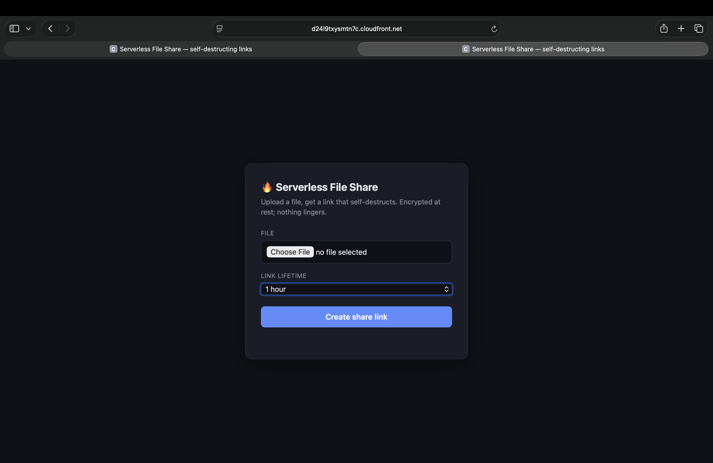
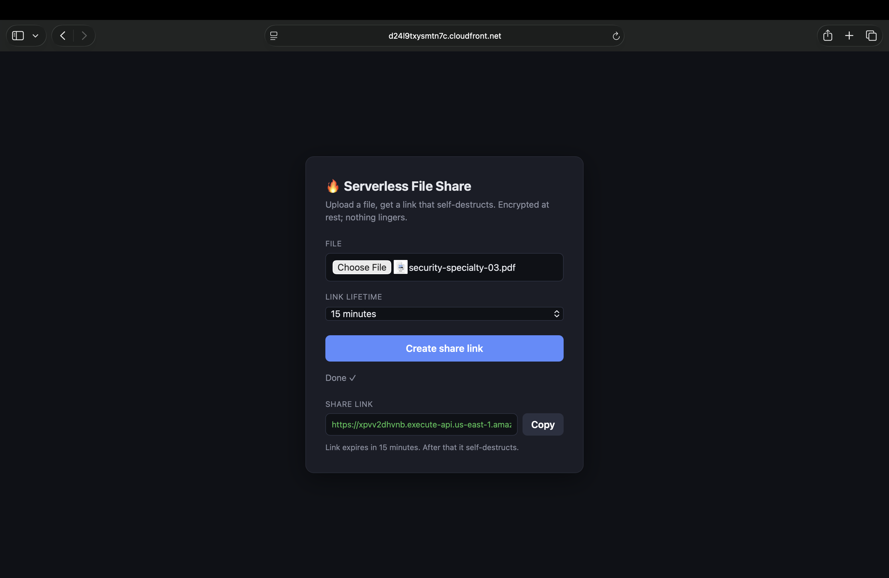
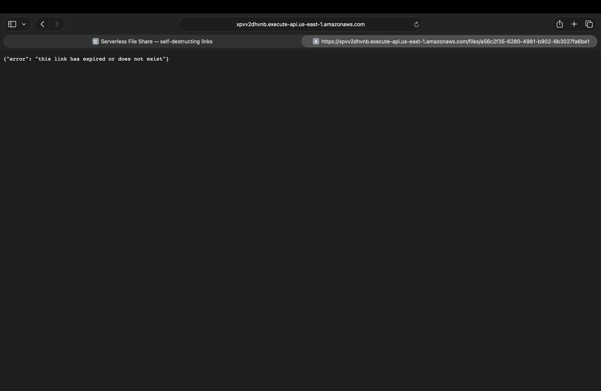

# Serverless File Share — self-destructing file sharing on AWS

> **Sep 2026 (v3):** AWS provider 5 → **6**, Lambda runtime 3.12 → **3.13**, Renovate + pre-commit + tflint so this cannot silently rot again. 16 moto tests still green.
>
> **Sep 2026:** filename sanitisation + RFC 5987 `Content-Disposition` (header-injection fix), structured JSON logs, reaper partial-batch failures, 16 moto tests, checkov baseline — deployed live and smoke-tested.

Share a file through a link that expires. Files are encrypted at rest, links die on a timer, and the file itself is destroyed after expiry — nothing lingers.

**Status:** ✅ All stages complete — full IaC + CI/CD ([docs/stage5.md](docs/stage5.md)). See the [architecture diagram](docs/architecture.md). Built in public.

> **Level-up (Phase 2) — zero-knowledge, end-to-end encrypted.** Every share is now **encrypted in the browser before it is uploaded**. A one-time **AES-256-GCM** key is generated client-side (WebCrypto), the file *and its filename* are sealed into ciphertext, and only that ciphertext reaches S3. The key travels in the share link's **`#fragment`** — which browsers never send to a server — so the API, the Lambdas, S3, and the operator only ever see ciphertext. **The service cannot read your file, or even its name.** SSE-KMS remains underneath as defense-in-depth (double encryption). Same no-login flow; the recipient's browser fetches the ciphertext and decrypts locally. Also new: 📝 **secret-note mode** (share a password/message, not a file), 🔥 **burn-after-reading**, drag-and-drop, and a QR code for the link. Design + threat model: [`docs/e2ee.md`](docs/e2ee.md).
>
> **Level-up (Phase 1) — from demo to product.** Every share link now supports three optional, no-login controls, all enforced server-side:
> - 🔒 **Password protection** — the password is stored only as a **PBKDF2-SHA256** hash (random per-file salt, 120k iterations); the plaintext never touches the backend.
> - `#` **Download limit** — cap a link at *N* downloads. The count is enforced with an **atomic DynamoDB conditional update**, so concurrent fetches can't slip past the cap. The link goes 410 Gone once the cap is hit.
> - 📧 **Download notifications** — the uploader can be emailed (via **SES**) on each download.
>
> This split the download into two verbs on one resource: `GET /files/{id}` returns *metadata only* (so the download page can prompt for a password), and `POST /files/{id}` validates the password + limit, fires the notification, and returns a short-lived presigned URL. See [`web/get.html`](web/get.html).

## v2 (Sep 2026) — hardened, tested, observable

| | |
| --- | --- |
| **Header-injection fix** | A share named `evil"; filename="x\r\nX-Injected: 1.txt` used to go straight into the presigned URL's `Content-Disposition`. Filenames are now sanitised at issue time (no path separators, quotes or control characters, bounded length) and the download header is built per RFC 6266/5987 — an ASCII fallback plus `filename*=UTF-8''…` — so `résumé "final".pdf` round-trips correctly and CR/LF can never reach a header. Verified live. |
| **Input robustness** | Non-object JSON bodies and non-integer `expiresInSeconds` are 400s instead of 500s; an item missing its object key is 410, not a crash. |
| **Structured logs** | Every Lambda emits one JSON line per event (`issued`, `download`, `bad_password`, `cap_hit`, `reaped`, `reap_failed`, `batch`) with the file id — the observability project's Logs Insights queries can filter on real fields now. Never the content, never the key. |
| **Reaper partial-batch failures** | The reaper returns `batchItemFailures` for a record whose S3 delete failed, and the stream mapping uses `ReportBatchItemFailures`, so only that record is retried instead of the whole batch of ten. |
| **Tests** | 16 pytest cases against moto-mocked S3/DynamoDB/SES (`tests/`): presigned PUT bound to the declared size, lifetime clamping, the 100 MB cap, sanitisation cases, per-file PBKDF2 salts, info → fetch, expired/missing → 410, the password gate, the **atomic download cap**, best-effort SES, injection-safe disposition, and the reaper's REMOVE-only + partial-failure semantics. Run in CI. |
| **IaC** | checkov against a reviewed baseline (100 passed, 0 failed): the DLQ is now SSE-encrypted and the bucket aborts incomplete multipart uploads after a day (a closed tab mid-upload used to leave billed, invisible parts behind). |

Deployed to the live functions on 2026-09-19 and smoke-tested end to end (issue → PUT → info → wrong password 401 → download with the encoded header → cap 410).

## Screenshots

| Upload | Share link | Expiry |
|---|---|---|
|  |  |  |

## Why this project

A small, real product that demonstrates security-first serverless architecture: least-privilege IAM, KMS encryption, short-lived access via presigned URLs, and a fully automated data lifecycle. No servers to patch, near-zero cost at rest.

## Target architecture

```
Sender/Recipient
      │
      ├──> CloudFront ──> S3 (static web UI)            [Stage 4]
      │
      └──> API Gateway ──> Lambda "issue-url"
                              │        │
                              │        └──> S3 files bucket (private, SSE-KMS)
                              │                      ▲ presigned PUT/GET
                              └──> DynamoDB (metadata, TTL)
                                       │  TTL expiry → DynamoDB Streams
                                       └──> Lambda "reaper" ──> deletes object + metadata
                                                                (S3 lifecycle rule as backstop)
```

## How it works

1. Sender asks the API for an upload link. Lambda returns a **presigned PUT URL** (short expiry) and writes a metadata item to DynamoDB with a **TTL** matching the file's lifetime.
2. The file lands in a **private, SSE-KMS-encrypted bucket**. Block Public Access is on account-wide; nothing is ever public.
3. The share link is a **presigned GET URL** whose expiry is chosen by the sender (15 minutes to 7 days).
4. When the TTL fires, DynamoDB Streams triggers the **reaper Lambda**, which deletes the S3 object and the metadata item. An S3 **lifecycle rule** acts as a backstop in case the reaper ever fails.

## Services and why

| Service | Role here |
|---|---|
| S3 | File storage; also hosts the static UI later |
| Lambda | issue-url (create presigned URLs + metadata) and reaper (delete on expiry) |
| API Gateway | HTTPS front door, throttling, later auth |
| DynamoDB | File metadata; TTL drives self-destruction; Streams triggers the reaper |
| KMS | Customer-managed key for SSE-KMS encryption at rest |
| IAM | One least-privilege role per Lambda |
| EventBridge | Alternative scheduler considered for expiry (documented trade-off) |
| CloudFront + Route 53 | UI delivery + custom domain (Stage 4) |
| Terraform + GitHub Actions | Infrastructure as code + CI/CD (Stage 5) |

## Security decisions

- **Block Public Access** everywhere; the only way to touch a file is a presigned URL.
- **SSE-KMS** with a customer-managed key; the key policy grants use only to the two Lambda roles.
- **Least privilege per function:** the issue-url role can `s3:PutObject`/`s3:GetObject` on the files prefix and `dynamodb:PutItem` on the table — a presigned URL can never grant more than its signer holds. The reaper role can only `s3:DeleteObject` and `dynamodb:DeleteItem`.
- **Short-lived everything:** upload URLs expire in minutes; download expiry is sender-chosen and capped.
- **No secrets in code**; CloudTrail on for a full audit trail.

## Roadmap

- [x] Stage 0 — Repo, account hygiene (IAM admin + MFA, $5 budget alarm), AWS CLI
- [x] Stage 1 — Manual MVP: private encrypted bucket, upload via CLI, presigned GET, verify expiry
- [x] Stage 2 — API: Lambda + API Gateway issue presigned URLs; DynamoDB metadata with TTL
- [x] Stage 3 — Self-destruct: TTL → Streams → reaper Lambda; lifecycle backstop; SSE-KMS + least-privilege IAM
- [x] Stage 4 — Minimal web UI on S3 + CloudFront (custom domain deferred — see docs/stage4.md)
- [x] Stage 5 — Terraform rebuild (`terraform/`, 38 resources), GitHub Actions CI/CD, [architecture diagram](docs/architecture.md)

**Future scope:** authentication (Cognito JWT), custom domain, observability, and more — designed in [docs/future-scope.md](docs/future-scope.md).

## Cost

Designed to live in the free tier: S3 + Lambda + DynamoDB on-demand + API Gateway at hobby volume costs pennies. A $5 budget alarm guards the account.

---

Built by Rajolu Abheenash — [github.com/Abheenash](https://github.com/Abheenash)
