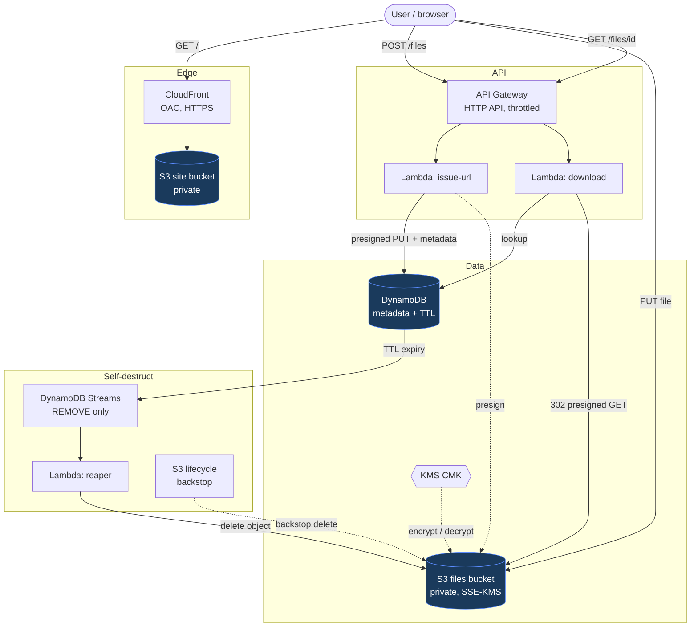

# Architecture

## Flow in words

1. **Serve UI** — browser hits CloudFront, which reads the private S3 site bucket via Origin Access Control.
2. **Upload** — `POST /files` → `issue-url` Lambda presigns a PUT URL and writes a metadata item with a TTL. The browser uploads the file bytes straight to the encrypted files bucket.
3. **Share / download** — the share link is `GET /files/{id}`; the `download` Lambda checks the metadata and 302-redirects to a short-lived presigned GET (or `410` if expired).
4. **Self-destruct** — when the TTL fires, DynamoDB Streams delivers a `REMOVE` event to the `reaper` Lambda, which deletes the S3 object. An S3 lifecycle rule is the backstop.
5. **Encryption** — everything at rest in the files bucket uses a customer-managed KMS key; only the Lambda roles that need it may use the key, and only via S3.

## Security posture

- No public buckets anywhere; presigned URLs and CloudFront OAC are the only access paths.
- One least-privilege IAM role per Lambda — a presigned URL can never grant more than its signing role holds.
- Short-lived everything: upload URLs (15 min), download URLs (5 min), file lifetime (≤ 7 days, TTL-enforced).

See per-stage detail in [stage1](stage1.md) · [stage2](stage2.md) · [stage3](stage3.md) · [stage4](stage4.md) · [stage5](stage5.md).
